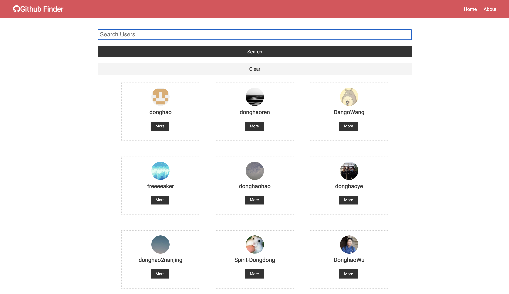
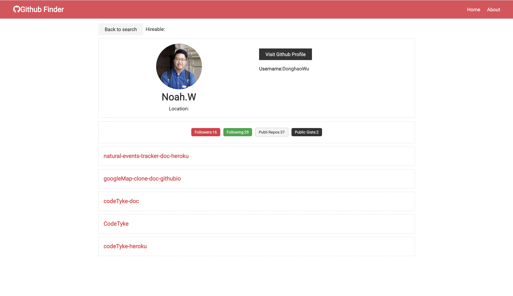

# github-finder-doc

- Deploy Netlify URL:[https://github-finder-2021.netlify.app/](https://github-finder-2021.netlify.app/)

-----------------------------------------------------

-----------------------------------------------------

-----------------------------------------------------

- [Part 16 - Github API, Context API. :gem::gem:](https://github.com/DonghaoWu/github-finder-doc/blob/main/GithubAPI-ContextAPI.md)
    - __`Code base: NEW`__ 
    - __`Doc Repo URL:`__[Github finder doc](https://github.com/DonghaoWu/github-finder-doc)
    - __`Deployed Repo URL:`__[Github finder netlify](https://github.com/DonghaoWu/github-finder-netlify)
    - __`Key Words: React hooks, Github APi, Context patterns, react syntax(语法), netlify.`__

- Back to [Frontend-tools-demo](https://github.com/DonghaoWu/Frontend-tools-demo)